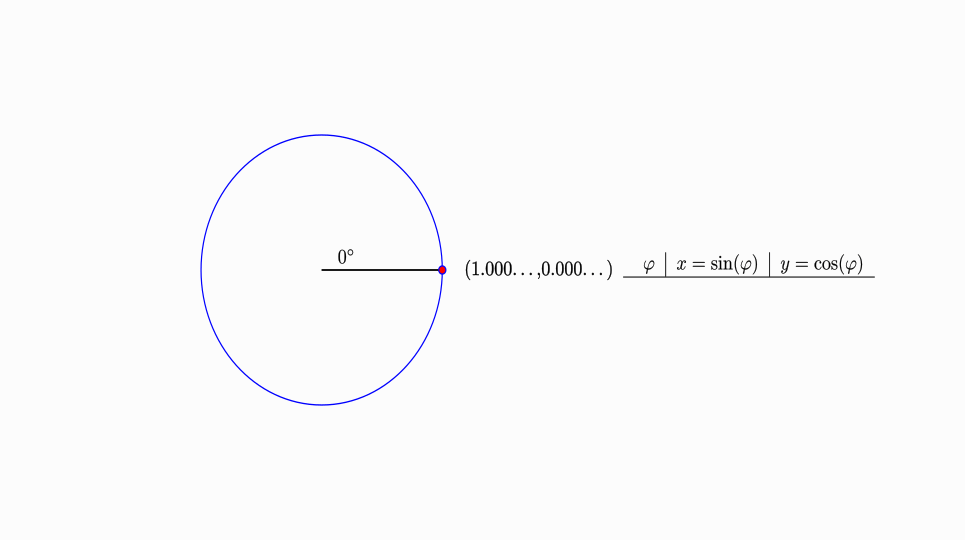

# Code for animation of pentagram vertices

This is a small animation of how to obtain the coordinates of vertices of a pentagram.
Both polar and Cartesian coordinates are depicted (the distance from the center $r$ equals
one).  
The animation was created using [reanimate](https://reanimate.github.io), a Haskell
library for the creation of animations.

## How to use

If you never used [reanimate](https://reanimate.github.io) check out their
[tutorial](https://reanimate.readthedocs.io/en/latest/#getting-started) or
read about it in my [blog posts]() (coming soon).

If you have some experience with [reanimate](https://reanimate.github.io) use the
following command to compile a gif (after you have cloned the repo):

```bash
stack src/Main.hs -- render --format gif --compile -w 965 -h 540 -o src/Pentagram.gif
```

**Note**: You can change the resolution of the gif if you want, but keep a ratio of 16/9.

This should result in the following gif:



It should be located in `src` and you can open it with a internet browser or a image
viewer, which is capable of running gifs.
